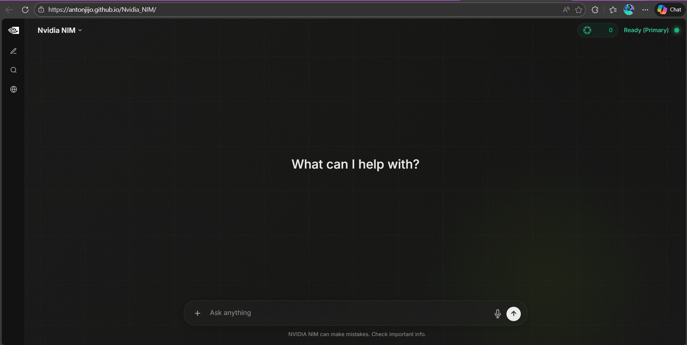

# NVIDIA NIM Chatbot 🤖

An advanced, privacy-focused AI assistant powered by **NVIDIA NIM** and **OpenRouter**, designed with a premium, responsive interface. Now available as a native application on **Android** and **Windows**.

## ✨ Features

- **🎨 Premium Interface**: A sleek, minimal, and fully responsive dark-mode UI with sidebar history, smooth animations, and Markdown support.
- **🧠 Multi-Model Engine**: Switch instantly between top-tier models, including:
  - **Meta Llama 4 Maverick 17B**
  - **DeepSeek R1, V3.1 & V3.2** (Reasoning & General Experts)
  - **Qwen 2.5 Coder 32B & Qwen 3 Coder 480B**
  - **Moonshot Kimi K2 Thinking**
  - **Google Gemma 3 27B**
  - **OpenAI GPT OSS 120B**
- **🎓 Study Mode**: A dedicated pedagogical mode that uses the "Teach & Check" protocol to help users learn complex topics effectively.
- **🌐 Intelligent Web Search**: Automatically detects intent (e.g., "Latest news", "Stock prices") and fetches factual summaries from Wikipedia and Tavily.
- **📂 Multimodal Analysis**: Upload text files for deep analysis or images for vision-based insights (powered by **Nemotron Nano 12B VL**).
- **💾 Local Persistence**: Your chats are saved securely in your browser's local storage—no account required.
- **⚡ High Performance**: Non-blocking classification checks and streaming-style responses.

---

## 📱 Native Applications

Experience the chatbot natively on your preferred device. **[Download the latest versions here](https://github.com/AntonJijo/Nvidia_NIM/releases)**.

### 🤖 Android App
- **Secure WebView**: Hardened Android application (Package: `com.antonjijo.nvidianim`).
- **Production Signed**: Release-signed APK ready for installation.
- **Features**: 
  - Strict URL loading policy.
  - Mixed content blocked.
  - Safe browsing enabled.

### 🪟 Windows Desktop
- **Electron App**: A standalone Windows executable (`.exe`).
- **Signed & Hardened**: Digitally signed with a CA-issued certificate to eliminate SmartScreen warnings.
- **Production Ready**: Verified publisher trust and optimized performance.

---

## 🛡️ Enterprise-Grade Security

This application has undergone a comprehensive security audit (January 2025) and is production-ready.

- **✅ STRICT CSP**: Content Security Policy enforcing strict source whitelists.
- **✅ Input Sanitization**: Robust XSS prevention and input validation.
- **✅ Rate Limiting**: Anti-abuse protection for all API endpoints.
- **✅ Secure Headers**: Implementation of HSTS, X-Frame-Options, and more.
- **✅ CORS Policy**: Restricted origin access for production environments.

For full details, view the [Security Audit Report](SECURITY.md).

---

## 🚧 Beta Features & Limitations

The following advanced capabilities are currently in **BETA**:

* **🖼️ Image Analysis**
* **📂 File Analysis**
* **🌐 Web Search (Wiki/Tavily Mode)**

> [!NOTE]
> These features **will not work perfectly** at all times. They require significant performance and system resources to process, scrape, or analyze external data. You may experience occasional latency, timeouts, or limitations when using these specific tool-based features compared to standard text generation. We are continuously optimizing them!

---

## 💻 Technologies

- **Backend**: Flask (Python) with Gunicorn
- **Frontend**: Vanilla JavaScript, HTML5, Tailwind CSS
- **AI Integrations**: NVIDIA NIM, OpenRouter, Tavily API

---

## 🙌 Acknowledgements

Built with ❤️ using [Flask](https://flask.palletsprojects.com/), [NVIDIA NIM](https://build.nvidia.com/), [OpenRouter](https://openrouter.ai/), [Electron](https://www.electronjs.org/), and [Android](https://developer.android.com/).
